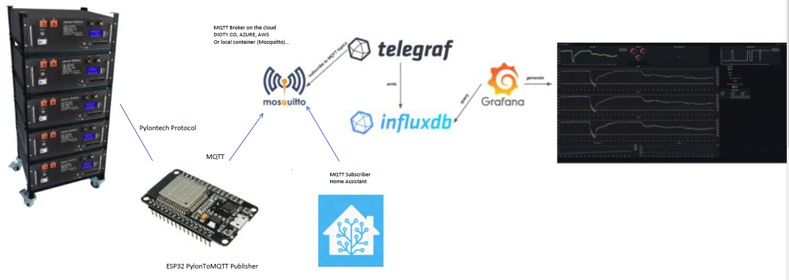

# PylonToMQTT
  
<h2>Pylon console to MQTT for Jakiper server rack Lithium battery</h2>

[](https://hits.seeyoufarm.com)

<!--- 
[](https://github.com/ClassicDIY/ClassicMQTT/releases)
[](https://github.com/ClassicDIY/ClassicMQTT/releases)
[](https://github.com/ClassicDIY/ClassicMQTT/issues)
-->




<p>
The PylonToMQTT publisher will read data from your Jakiper Battery Bank using the Pylontech protocol via the RS232 console port and publish the data to a MQTT broker. This allows you to integrate other MQTT subscriber applications like HomeAssistant, NodeRed, InfluxDB and Grafana.

The software is provided "AS IS", WITHOUT WARRANTY OF ANY KIND, express or implied.
</p>

## License
```

 Copyright (c) 2022

  Licensed under the Apache License, Version 2.0 (the "License");
  you may not use this file except in compliance with the License.
  You may obtain a copy of the License at

       http://www.apache.org/licenses/LICENSE-2.0

  Unless required by applicable law or agreed to in writing, software
  distributed under the License is distributed on an "AS IS" BASIS,
  WITHOUT WARRANTIES OR CONDITIONS OF ANY KIND, either express or implied.
  See the License for the specific language governing permissions and
  limitations under the License.

```
